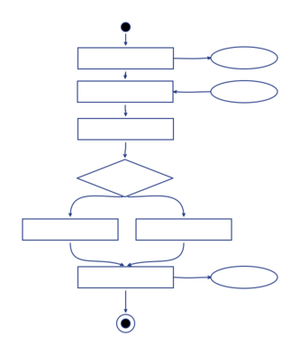

Algorigrammes
=============

T'ai-je dit que nous allons dessiner ? Oui ? Alors, viens dessiner ! Prépare un stylo, feutre, crayon... et des feuilles de papier !

Dans les prochains chapitres, nous allons dessiner des petites briques : chacune d'entre elle servira à faire une petite chose simple (et un peu bête), mais en posant ces briques sur d'autres briques nous pourrons exprimer des choses de plus en plus malines et fantastiques ! (oui-oui !)

Mais dans un premier temps il faut que je te présente les petites briques...

Définition
----------

__Algorigramme__ : Algori(thme) + (dia)gramme

Il s'agit du nom de ce genre de dessins : c'est la représentation graphique de l'enchaînement des _opérations_ et des _décisions_ effectuées par un programme d'ordinateur. C'est l'ensemble de ces enchainements qui donne une utilité et un sens au programme.

Exemple d'algorigramme:

Dans cet algorigramme, j'ai volontairement masqué les intitulés des cases car c'est la forme dans son ensemble que je veux te montrer (mais sois rassurée, nous le retrouverons bientôt, car c'est l'un des prochains exercices).

Comme tu peux le voir ici, il y a un début, puis des étapes qui se suivent sans choix, des étapes qui se suivent avec des choix, des étapes qui inter-agissent avec des patates sur les cotés, et aussi une fin.

> « Mais alors, dit Alice, si le monde n'a absolument aucun sens, qui nous empêche d'en inventer un ? »  
> <em>Lewis Carroll, Les aventures d'Alice au pays des merveilles</em>

Structure d'un programme
------------------------

Un programme informatique suit en général une structure calquée sur la suite des phases suivantes, dans l'ordre : __déclarations__, __initialisations__, __programme principal__, __gestion des erreurs__, __sortie__.

### Phase 1 : Déclaration

Comme dans une recette de cuisine, il s'agit de l'endroit ou l'on va annoncer ce dont on a besoin. 

Par exemple, pour la recette d'une omette, on dira « vous avez besoin de 3 oeufs, d'un oignon, de persil, d'une pincée de sel et de poivre... ». Ainsi le cuisiner va pouvoir vérifier qu'il a bien tout ce dont il a besoin pour exécuter la recette et préparer les éléenrs nécessaires sur le plan de traval.

Dans un programme informatique il s'agira de faire l'inventaire des informations que l'on va chercher à manipuler et surtout éviter de sortir une nouvelle information de notre chapeau en cours de route.

On verra par la suite (pseudo-code, code source, etc.) que cette partie est essentielle pour deux choses : d'abord pour que le programmeur puisse rester cohérent tout au long de la mise en oeuvre de son idée, ainsi qu'à l'ordinateur pour puisse préparer la mémoire qui permettra de faire fonctionner le programme.

### Phase 2 : Initialisation

C'est là qu'on prépare nos ingrédents !

C'est bien de savoir qu'on aura besoin de 3 oeufs et d'un oignon, mais peut-être faut-il les préparer ? mieux les préparer sur le plan de travail, ou bien aller les chercher dans le réfrigérateur au moment ou l'on en a besoin ? 

Naturellement, pour un travail efficace, on préfèrera sortir les ingrédients à l'avance et peser les bonnes quantités avant de suivre les étapes de la recette.

### Phase 3 : Programme principal

C'est la suite d'étapes qui constitue le corps de la recette, c'est là qu'on mélange, qu'on touille, qu'on fait tout ce qui doit être fait afin de transformer les ingrédients en une délicieuse préparation !

Dans un programme informatique, c'est là que l'on organisera les données entre elles, que l'on fera des calculs et qu'on l'on transformera les informations de départ en quelque chose d'utile.

### Phase 4 : Gestion des erreurs

En cuisine, il arrive qu'il y ait des ratés. Parfois il suffit d'un instant d'inattention et c'est trop cuit, parfois c'est mal exécuté, parfois c'est les ingrédients...

Dans un ordinateur aussi, ça arrive. Au début ce sera souvent la faute d'un programme mal conçu. On verra aussi que les interractions avec les données ne se passent pas toujours comme prévu... et parfois c'est aussi l'utilisateur qui ne se comporte pas comme prévu (ou il le fait exprès le fourbe !). 

Bref. Il faut anticiper les cas d'erreurs et essayer des les gérer le mieux possible. À minima, dire à l'utilisateur (ou aux autres programmes) qu'il y a une probleme... l'important c'est de communiquer ;-)

### Phase 5 : Sortie(s)

Dans une recette, cela correspond au moment ou l'on retire le plat du feu, que l'on nappe les sauces ou que l'on dresse le plat.

En informatique, il s'agira de rentre présentable, agréable, claires et utiles les informations transformées : le plus souvent il s'agirant d'afficher quelque chose, de produire un fichier ou de transmettre une information.

> « Prenez donc du vin, » dit le Lièvre d’un ton engageant.  
> Alice regarda tout autour de la table, mais il n’y avait que du thé. « Je ne vois pas de vin, » fit-elle observer.  
> « Il n’y en a pas, » dit le Lièvre.  
> <em>Lewis Carroll, Les aventures d'Alice au pays des merveilles</em>

À suivre ?
----------

Ça y est, on atteint le vif du sujet. Je viens bientôt te dévoiler l... ah non !... shuuut !... je ne peux rien dire jusqu'au prochain chapitre ! :-P

Tu veux la suite ? Envoie-moi un e-mail avec le texte __"JE VEUX LA SUITE !"__ accompagné d'__UN DESSIN__ (fait main) :-)

