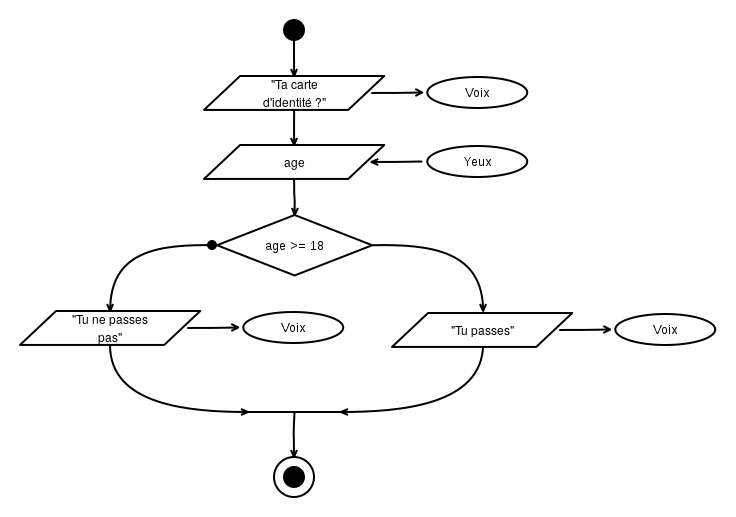
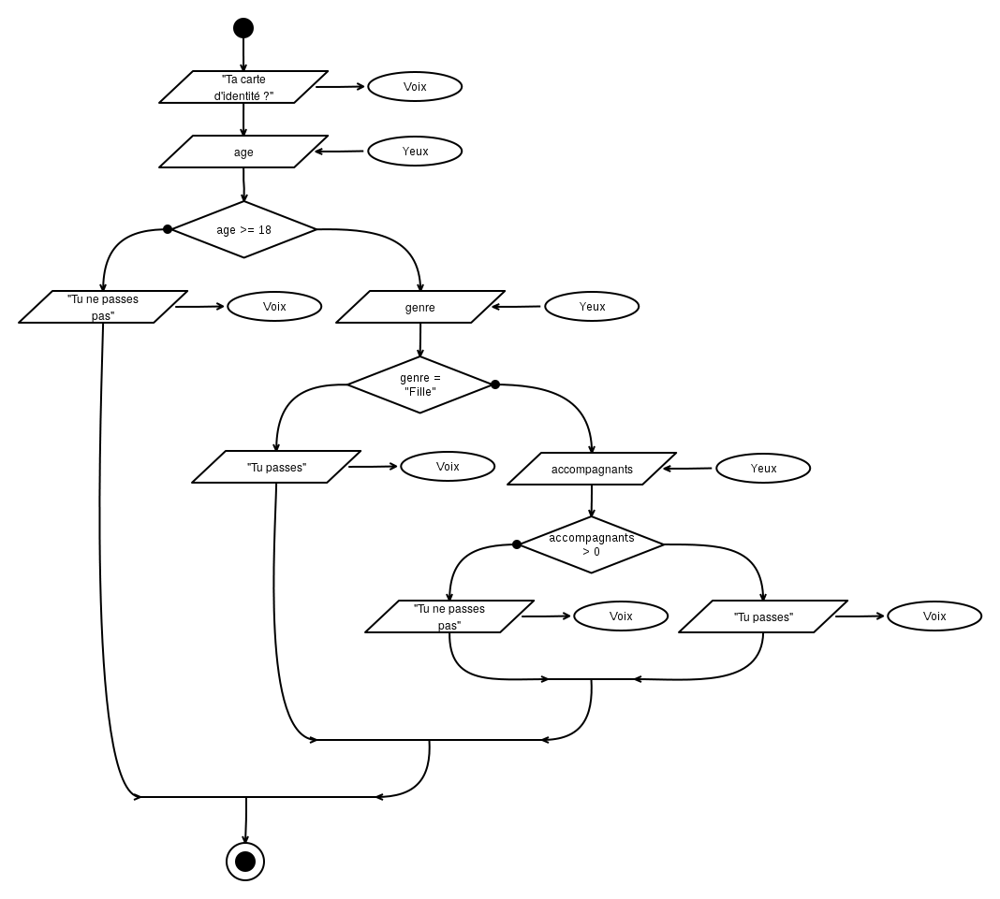

Algorigrammes (partie 3)
========================

Quand la population immobile est rivée sur un
rectangle vert avec des bonshommes
dessus, quand elle est nerveuse à l'idée de que son équipe rate un premier but, mais que le reste lui échappe... une courageuse s'affaire dans la chaleur d'un dimanche, pour préparer, sensibiliser, éduquer, sauver notre planète et améliorer notre avenir à tous. Ouf, merci, je suis (un peu) rassuré ;-)

Je te propose de reprendre tout doucement
notre cours avec une petite révision du chapitre précédent.

> « C'est bien engagé coté Irlandais... 
> balle récupérée par Murphy... 
> par Hendrick... Drogba... 
> elle a été contrée ! »  
> <em>Euro 2016, France-Irlande (2-1)</em>

Retour sur les instructions
---------------------------

Dans le chapitre précédent, je te parlais desquelques  __instructions__ de base d'un programme : le début, la fin, les entrées, les sorties, les variables.

Voyons un premier algorigramme qui assemble les briques que l'on a vu jusque là :

Alors, comment interpréter cela ? C'est très simple :

1. on démarre sur le rond noir (début), 
2. on suit la flèche,
3. on arrive sur une instruction de sortie, qui prends le texte ``"Quel est ton nom"`` et qui l'affiche sur le périphérique ``Ecran``,
4. on suite la flèche,
5. on tombe sur une instruction d'entrée, c'est à dire que le programme attend que l'utilisateur tape quelque chose, cela peut être n'importe quoi (par exemple : ``"Anatole"``). Lorsqu'il valide, le resultat est enregistré dans la variable (c'est à dire une case mémoire pointée par une étiquette) que l'on choisit d'appeller ``nom``,
6. on suit la flèche,
7. on arrive sur une nouvelle sortie qui prends le texte ``"Bonjour "`` et qui lui ajoute la variable ``nom`` (c'est à dire le contenu de la case mémoire pointé par l'équiquette). On obtient donc en mémoire le texte ``"Bonjour Anatole"`` qui part alors vers le périphérique ``Écran``.
8. on suit la flèche,
9. on arrive sur le rond cerclé, c'est donc la fin du programe.

Whaou. Nous sommes capables de demander un nom à l'utilisateur et de le saluer ! Pas mal pour un premier programme, non ?

Les instructions que nous avons vues jusque là permettent de faire bien des choses, mais elle ont un gros inconvénient : elle ne permetttent la conception que des programes _totalement linéaires_, quelle que soient les valeurs des variables ou les entrées du programme.

Pour améliorer cela, il faudrait être capable d'exprimer des conditions, et de faire des choix, c'est là qu'interviennent les __expressions booléennes__ et les __instructions conditionnelles__.

Les expressions booléeennes
---------------------------

Les __expressions booléennes__, sont des affirmations dont le résultat est soit ``VRAI``, soit ``FAUX``. Cela peut être une comparaison, une formule, ou le résultat d'un sous-programme (mais on en parlera plus tard de ce dernier point). Ce sont elles que l'on va utiliser comme conditions pour décider de la suite de notre programme.

On appelle ``VRAI`` et ``FAUX`` des _valeurs booléennes_. Sur la base de ces valeurs on peut définir quelques opérations logiques :

### La négation (NON ...)

Elle inverse la valeur de départ (ici A).

| A   | non A |
|------|------|
| VRAI | FAUX |
| FAUX | VRAI |

### L'intersection (... ET ...)

Elle n'est vraie que si les deux valeurs de départ (A, B) sont toutes deux vraies.

| A    | B    | A et B |
|------|------|--------|
| VRAI | VRAI | VRAI   |
| VRAI | FAUX | FAUX   |
| FAUX | VRAI | FAUX   |
| FAUX | FAUX | FAUX   |

### L'union (... OU ...)

Elle est vraie si l'une des deux valeurs de départ (A, B) est vraie.

| A    | B    | A ou B |
|------|------|--------|
| VRAI | VRAI | VRAI   |
| VRAI | FAUX | FAUX   |
| FAUX | VRAI | FAUX   |
| FAUX | FAUX | FAUX   |

### L'exclusion mutuelle (... XOR ...)

Elle n'est vraie que si les deux valeurs (A, B) sont différentes.

| A    | B    | A xor B |
|------|------|---------|
| VRAI | VRAI | FAUX    |
| VRAI | FAUX | VRAI    |
| FAUX | VRAI | VRAI    |
| FAUX | FAUX | FAUX    |

Les instructions conditionnelles
--------------------------------

Les __instructions conditionnelles__ sont les instructions qui vont nous aider à enrichir nos programmes en leur permettant de prendre des décisions. Elle servent à décider du déroulement de la suite en prenant un chemin parmis plusieurs, en fonction de certaines conditions.

### Les tests conditionnels

En général, les branches deux branches d'un test conditionnel finissent par se rejoidre : soit sur une suite d'instruction communes, soit directement sur la fin.

Point noir sur la flèche du coté FAUX.

#### Exemple 5.1. Le videur

Pour illustrer mes propos sur les tests conditionnels, prenons un exemple que tu as sûrement déjà vécu : le videur à l'entrée de la boite de nuit. Son rôle est simple: il vérifie l'age de la personne qui se présente à l'entrée, et ne laisse passer que les adultes dans la boite de nuit. S'il était un programme, son travail ressemblerait à cela :

#### Exemple 5.2. Le videur sexiste

Comme beaucoup de videurs, il arrive que celui-ci soit sexiste : après avoir vérifié l'age, il laisse automatiquement passer les filles (ne me demande pas pourquoi...), en revanche, un mec devra obligatoirement être accompagné pour passer !

Cela donnerait l'algorigramme suivant :

!!! note "Exercice 5.a"
    __Dessiner un programme__ qui demande à l'utilisateur de taper son nom et son mot de passe au clavier.
    Si son nom est ``"Hippolite"`` et que son mot de passe est ``"Genevieve2012"`` alors on le programme lui affiche à l'écran le message ``"Accès autorisé"``, sinon le programme lui affiche ``"Accès refusé"``.

!!! note "Exercice 5.b"
    __Dessiner un programme__ qui demande à l'utilisateur de taper son age et le stocke dans la variable ``age``.
    Calculer l'age qu'il aura l'année prochaine et stocker le résultat dans la variable ``age`` (la même). Ensuite lui afficher le message ``"L'année prochaine, tu auras XX ans"`` (avec XX remplacé par son age prochain).

### Les boucles

Les __boucles__ sont très semblables aux __test conditionnels__. La différence ? Les boucles possède une branche qui part vers l'arrière du programme. Elle sont les seules instructions à avoir la possibilité de faire cela.

À suivre ?
----------

FIXME: 

* Pour continuer : les photos de tes exercices ;)
et je veux la suite.

* on va corriger les exercices

* démarche pour analyser un énoncé / probleme
  * repérer les concepts => en faire des variables
  * les initialiser d'abord (idéalement)

* démarche pour structurer un programme
  * est-ce que ça boucle ? 
  * si oui, qu'est ce qui est répété ?
  * sinon est-ce qu'il y a une variation sur la base de qqchose
  * sinon pas de prise de tete

* pour le 06: On remarquera que les algorigrammes nécessitent énormément de place sur le papier, même pour des programmes simples !
