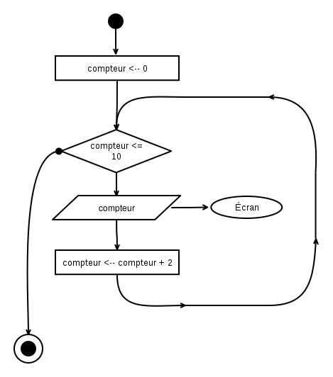

Algorigrammes (partie 4)
==============================

Oh ! Que j'étais impatient de les recevoir tes feuilles crayonnées ! J'ai cru qu'elles n'arriveraient jamais ! J'ai même cru que le facteur avait décidé de changer de vie après le dernier évènement sur le gaspillage !... ou qu'il avait recyclé tout le papier avant de le porter à destination !

__Eh bien bravo ! C'était très bien !__ Bon, j'ai tout de même quelques petits commentaires, parce que oui mademoiselle... le prof a forcément le dernier mot, c'est le jeu ! (nananèreu) :-)

Voyons d'abord comment décortiquer un énoncé dans le cas général et appliquons ensuite cela à nos quelques exercices. 

Tu me suis ?

Démarche générale pour analyser un énoncé
--------------------------------

Quand on est sur le point d'écrire un programme, c'est souvent le syndrome de la page blanche : quoi écrire ? par où commencer ? En fait il y a un méthode toute simple pour nous aider : il suffit de répondre à une courte série de questions qui vont nous aider décomposer le besoin, étape par étape. 

### Question : De quoi a-t-on besoin comme variables ? 

C'est très facile, il suffit de repérer les différents _concepts_ évoqués dans l'énoncé. Chacun de ces concepts peut donner lieu a une variable.

__Exemple :__ « Faire un programme qui compte de 1 à 10. »

* Variables : ``compteur``.

__Exemple :__ « Demander un nom et un mot de passe à l'utilisateur, si le nom est XXX et que le mot de passe est YYY, alors il passe, sinon il ne passe pas. »

* Variables : ``nom``, ``mot_de_passe``,  à ``utilisateur``, ``passe``.

Dans ce dernier exemple, on remarque que : 

* ``utilisateur`` représente un acteur, pas une donnée à manipuler. Donc on ne l'utilisera pas comme variable.

* ``passe`` représente une décision, il faudra donc utiliser un test conditionel. Pour améliorer la lisibilité des programme, on stocke parfois la valeur de cette décision (vrai/faux) dans une variable avant de l'utiliser dans le test conditionel. Cela permet notamme de "construire" la prise de décision petit à petit si celle-ci dépend de nombreux paramètres.

### Question : À quelle valeur ces variables sont-elles initialisées ?

Quel est le contenu d'une variable lorqu'on a rien mis dedans nous-même : du vide ? autre chose ?

En fait la mémoire est un composant electronique (donc éléctrique). À l'allumage du matériel elle contient... des états electriques résiduels dû aux aux variations de tension. Si on lisait les cases de la mémoire, les valeurs que l'on obtiendrait seraient totalement aléatoires ! Donc absolument rien d'intéressant !

En cours de fonctionnement, lorsqu'un programme déclare avoir besoin de mémoire pour ses variables, le système lui "donne" des cases. Soit ce sont des cases jamais utilisées depuis l'allumage, soit des cases qui ont été libérées ([... ♫ délivrées.. ♪](https://www.youtube.com/watch?v=wQP9XZc2Y_c)) par d'autres programmes.

Une case libérée n'est pas "vidée" de son contenu... pour des questions de rapidité. Elle contient donc encore la dernière valeur qu'un programme y a mise (et c'est très pratique pour le _hacking_). Pour palier à ce gros danger, certains langages initialisent la case à une valeur prédéfinie (``undefined`` en Javascript, ``nil`` en Ruby, etc.)

!!! warning "Ce qu'il faut retenir" 
    Lorsqu'on demande de la mémoire au système, la case obtenue n'est _jamais_ vide. On ne peut pas l'utiliser pour _lire_ des données ! Il est donc essentiel de __prévoir une valeur à mettre dedans__ tout au début du programme. C'est ce qu'on appelle __l'initialisation__.

### Question : Quel est le role et le sens de chaque variable ?

Quand on choisit d'utiliser une variable et qu'on lui donne nom, on lui donne un sens. En soit, on pourrait donner n'importe quel nom pour désigner cette même case... mais quelque part, en choisissant un nom, nous passons un contrat avec nous-même, un engagement à utiliser cette variable pour un certain but, avec un certain sens. 

On fera donc en sorte de respecter cet engagement pris lors du choix des variables tout au long du programme : __une variable = un concept__ donné. Si on souhaite manipuler une autre concept, alors on utilisera une autre variable. 

Pour garder cette cohérence tout au long du programme (le d'invariants) on prendra l'habitude de déclarer les variables que l'on utilisera et d'expliquer en commentaire son rôle.

### Question : Est-ce que certaines parties dépendent d'un choix ?

Si c'est le cas, on utilisera __un test conditionnel__ ! On dessine un losange et deux fleches (dont une avec un point).

On s'intéresse successivement aux différentes parties qui le composent : le __corps__, la __condition__ (pour la bifurcation), __avant__ le test, __apres__ le test.

### Question : Est-ce que certaines parties doivent être répétées ?

Si c'est le cas, c'est qu'il y aura __une boucle__ ! On dessine un grand cercle avec un losange dessus (pour la condition)

On s'intéresse successivement aux différentes parties qui composent la boucle : 
le __corps__, la __condition d'arrêt__, __avant__ la boucle, __apres__ la boucle.

### Question : Si on a une boucle, qu'est ce qui doit etre répété ?

Ce seront les condition du corps de la boucle, c'est à dire les instructions à mettre le long du cercle.

### Question : Si on a une boucle, quand est-ce que ma boucle s'arrête ?

Ce sera la __condition d'arret__, c'est l'inverse de la condition qui fait qu'on continue la boucle. 
On écrit cette condition dans le losange de la boucle.

Attention : la condition d'arret (ou de continuation) peut nécessiter des variables, et donc des initialisations !

### Questions : Et ensuite ?

S'il reste des choses que l'on a pas traitées, ou des points qui nécessitent plus de précisions : on réapplique la série de questions depuis le début, et on case les réponses dans la zone adéquate de l'algorithme.

> « Eh bien, ça veut dire à peu près la même chose », dit la Duchesse [...].  
> « Et la morale de ceci est : prenez soin du sens, les sons prendront soin d'eux-mêmes. »  
> <em>Lewis Caroll, Alice au pays des merveilles</em>

Solution des exercices 5.*
---------------------------------

### Solution 5.a : Login, mot de passe et accès...

* __De quoi va t-on avoir besoin comme variables ?__ Une pour stocker le nom (``nom``), et une autre pour stocker le mot de passe (``motdepasse``).
* __Comment sont-elles initialisées ?__ Au clavier.
* __Est-ce que certaines parties doivent être répétées ?__ Non.
* __Est-ce qu'il y a des choix à faire quelque part ?__ Oui, selon ce que contient ``motdepasse``.

Ici, l'ordre des autres instructions est quasiment donné par l'énoncé.

Ce qui nous donne : 

C'est bien, ça fait le job, mais on peut simplifier. Dans le chapitre [Algorigrammes III](05-algorigrammes), on mentionnait les expressions booléennes. On va les utiliser pou rassembler les deux conditions en une seule. 

On va donc écrire :

Commentaires sur ta solution : 

* __C'est très bien !__ Rien à redire au niveau de la logique : c'est une variante de la version non simplifiée. Ça fonctionne. 
* __Il manque des guillemets autour du texte__ qui est envoyé vers l'écran (ex: "Quel est ton nom ?" en haut,  "MDP ?" à mi-hauteur, "Accès refusé" à gauche, etc.). Sans les guillemets on croit que ce sont des variables !
* C'est intéressant que tu aie mis les instructions pour la demande du mot de passe dans la branche à droite (après le test du nom)... et ça fait gagner du temps si le nom n'est pas bon (pas besoin de demander une information inutile). C'est bien vu.

!!! note "Hors-sujet"
    Si on s'intéresse à une utilisation réelle, __ton programme pose un problème de sécurité.__
    
    Une personne non-autorisée pourrait [essayer différents noms](https://fr.wikipedia.org/wiki/Attaque_par_dictionnaire)... et selon que "mot de passe ?" apparaît ou non, cela lui donnerait un indice sur l'existance (ou non) de cet utilisateur dans le système. Une fois un nom correct trouvé, il lui resterait à se concentrer sur les mots de passes !

    En termes de sécurité, on préfèrera donc demander toutes les informations d'un coup et présenter un comportement identique en cas de refus, qu'une seule ou que plusieurs informations soient fausses. Ne laissons pas fuiter d'indices !

### Solution 5.b : Age, l'année d'après

* __De quoi va t-on avoir besoin comme variables ?__ Une pour stocker l'age entré par l'utilisateur... et c'est tout (puisqu'on nous dit d'utiliser la même pour l'age futur que l'on calculera).
* __Comment sont-elles initialisées ?__ Depuis une valeur entrée au clavier.
* __Est-ce que certaines parties doivent être répétées ?__ Non.
* __Est-ce qu'il y a des choix à faire quelque part ?__ Non.

Commentaires sur ta solution : 

* __Tu es en avance sur le cours !__ Pour l'instant on ne peut pas encore écrire ``<age>`` en plein milieu d'un texte, parce qu'il faudrait comprendre comment ça fonctionne (et pour l'instant on ne sait pas) !  En plus ça ne fonctionne pas partout : on retrouvera cette écriture bien pratique dans certains langages de programmation (PHP, Ruby, etc.) mais pas dans d'autres (Javascript, C, etc.). Ce sera également possible lorsque tu apprendras à manipuler des _templates_ (des morceaux de HTML dans lequel on remplace certaines zones par le contenu des variables). Mais bon... pour l'instant on va seulement coller des bouts de texte les uns à coté des autres :-)

### Solution 5.c : Compter de deux en deux, de 0 à 10

* __De quoi va t-on avoir besoin comme variables ?__ Un ``compteur``
* __Comment sont-elles initialisées ?__ On démarre le compteur à zéro.
* __Est-ce qu'il y a des choix à faire quelque part ?__ Non.
* __Est-ce que certaines parties doivent être répétées ?__ Oui, on répète l'affichage et on ajoute 2 au  ``compteur`` à chaque tour.
* __Quand est-ce qu'on arrête la boucle ?__ Quand on dépasse 10.

Commentaires sur ta solution : 

* __C'est parfait !__ j'ai copié ta solution pour le corrigé :-)

### Solution 5.d : Boite de nuit limitée à 300 places

Pour adapter le videur de base (exemple 5.1) afin qu'il ne laisse entrer que 300 visiteurs dans la boite de nuit, il faudrait :

* compter les visiteurs (avec une variable ``visiteurs``)
* ajouter une boucle (qui continue tant que ``visiteurs <= 300``)
* incrémenter cette variable à chaque tour (``visiteurs <-- visiteurs + 1``)

Commentaires sur ta solution : 

* __C'est good !__ Rien à redire.

> Ici, voyez-vous, il faut courir aussi fort qu'on le peut simplement pour rester au même endroit. 
> Si on veut se rendre ailleurs, il faut courir encore au moins deux fois plus vite. 
> <em>Lewis Caroll, De l'autre côté du miroir (1872)</em>

À suivre ?
----------

La prochaine fois, on reprends le cours ! Et on remarquera que les algorigrammes nécessitent énormément de place sur le papier (même pour des programmes simples), on va commencer à voir du vrai code...  

