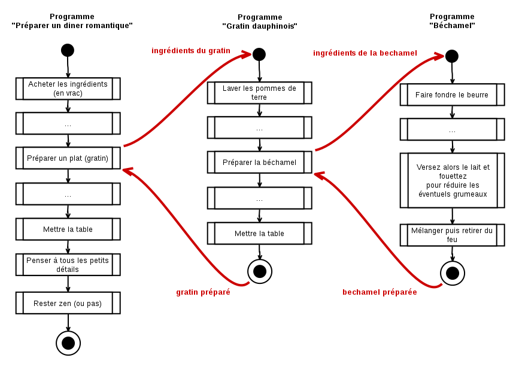

Algorigrammes (partie 5)
==============================

Super ! Quelle motivation ! Trop bien ! 

Ok, cette fois on passe aux choses sérieuses ! La dernière fois je te disais vouloir commencer du _vrai code_ dans ce chapitre mais là je me rends compte qu'il nous manque encore une notion super importante avant de continuer... donc ça sera pour la prochaine fois ! Suspense :-)

Tu as remarqué que nos algorigrammes prennent _beaucoup_ d'espace à dessiner ?  Juste avec deux ou trois conditions, ça devient déjà le bazar à lire et à écrire ! On va donc voir un _truc_ pour simplifier tout ça.

Sous-programmes, fonctions et procédures
--------------------

### La métaphore de la recette (encore !)

Il y a quelques pages, nous avions défini un programme comme un ensemble d'ingrédients et d'étapes nécessaires pour réaliser un objectif. Un peu comme une recette de cuisine finalement. 

Avec cette définition, nous pouvons dire qu'un sous-programme est une deuxième recette de cuisine, mentionnée dans la première recette et dont le résultat est utilisé par la première recette.

#### Exemple 7.1. Le gratin et la béchamel

Voyons les deux recettes suivantes : d'abord la béchamel...

~~~
Recette de la béchamel
======================

Ingrédients (pour 4 personnes) : 40 g de beurre,
   40 g de farine,  1/2 L de lait,  1 pincée de
   muscade râpée, sel, poivre.

Préparation :

1. Dans une casserole sur feu vif, faites fondre
   le beurre jusqu'à ce qu'il soit mousseux. 
2. Versez d'un coup la farine et mélangez vivement
   avec une spatule en bois, jusqu'à ce que le
   mélange soit homogène et commence à dorer
   légèrement. 
3. Versez alors le lait et fouettez pour détruire
   les éventuels grumeaux. Baissez le feu et
   continuez de mélanger en continu jusqu'à ce que
   la béchamel épaississe. 
4. Salez, poivrez, ajoutez la noix de muscade.
   Mélangez puis retirez du feu.
~~~

En supposant toutes les actions correctement menées, on peut dire que cette recette produit un résultat : la béchamel (sans blague !)
et ce résultat dépend uniquement des ingrédients de départ.

C'est ok jusque là ? On continue avec l'autre recette :

~~~
Recette du gratin dauphinois
============================

Ingrédients (pour 4 personnes) :  1 kg de pommes
   de terre, 60 g de beurre, 40 g de farine, 150 g de
   fromage râpé, 1/2 L de lait, 1 pincée de muscade
   râpée, sel, poivre.

1. Lavez et pelez les pommes de terre. Plongez-les
   dans un grand volume d'eau froide et portez à
   ébullition. Cuisez 15 à 20 min.
2. Pendant ce temps, réalisez la béchamel.
3. Préchauffez votre four à 200°C (th.6-7).
   Lorsqu'elles sont cuites, égouttez les pommes
   de terre et coupez les en rondelles d'environ 5
   mm d'épaisseur. Répartissez-les dans le plat en
   salant et poivrant régulièrement. Versez dessus
   la béchamel et lissez-la de façon à ce 
   qu'elle se répartisse partout. 
4 Parsemez le fromage râpé, et enfournez pour
   20 min. Servez bien chaud, décoré de brins de
   persil et accompagné d'une grosse salade verte.
~~~

La recette du gratin est plus intéressante que la précédente. 
On peut y noter que :

* Cette recette produit un résultat : la gratin dauphinois. Ce résultat 
  intègre de la béchamel.
* On a supposé connu l'action ``réaliser la béchamel`` à l'étape n°2
* Cette recette dépend des ingrédients de départ
* Cette recette dépend également de 
  la transformation d'une partie des ingrédients par la recette de la béchamel

### Recettes et première approximation

Si nous étions entrain de cuisiner en suivant minutieusement un livre de recettes, au moment de l'instruction ``réaliser la béchamel`` nous aurions tourné
quelques pages de notre livre pour aller à la recette ̀``Béchamel``. 

À partir de là nous aurions suivi les ingrédients et les instructions de cette nouvelle page comme s'il s'agissait de notre recette principale.

On peut en déduire que : 

* "Recette de la Béchamel" est un __sous-programme__ du programme 
    principal "Gratin" 
* Il suffit de fournir les bons ingrédients à la recette de la béchamel (types & quantités) pour réaliser une béchamel
* Elle peut être __utilisée indépendamment__ de la recette du du gratin, pour réaliser d'autres recettes (ex: pour faire des [aubergines façon "papoutsakia"](http://www.fashioncooking.fr/2012/06/melitzanes-papoutsakia-aubergines-farcies-grecques/)) ! 

### L'instruction "sous-programme"

Dans un algorigramme, __un instruction rectangulaire avec deux barres de chaque coté représente l'utilisation d'un sous-programme__ :

1. À l'arrivée dans une instruction _double-barrée_, on "saute" dans le sous-programme concerné
2. .. on suit les flèches et on exécute ce qui doit etre exécuté
3. ...jusqu'à terminer le sous-programme
4. ...ce qui nous amène à l'instruction que l'on avait quittée dans le programme principal !

#### Exemple 7.2. L'algorigramme du dîner romantique

On peut décrire la préparation d'un dîner comme un programme avec des instructions de "haut niveau". Chacune de ces instructions correspond en fait à un sous-programme dans lequel on peut zoomer... pour découvrir d'autres instructions, et ainsi de suite.

### Vocabulaire et définitions

Dans le monde du développement, il finalement est assez rare de parler de sous-programmes,
on parlera plutôt de __fonctions__ ou de __procédures__. Même s'il est fréquent de confondre les deux.

* __Une fonction fabrique un résultat__ qui sera utilisée par le programme  principal
* __Une procédure ne produit pas de résultat mais réalise des actions__ à effet de bord (ex: afficher une fenêtre, envoyer des données sur le réseau, etc.)

Dans ces sous-programmes, il faut distinguer deux moments importants : leur __déclaration__ et leur __appel__ .

* __La déclaration__ ou la __définition__ d'un programme, c'est quand on écrit &mdash; ou qu'on dessine &mdash; les instructions qui le composent.

* __L'appel__ , c'est lorsqu'on fait référence à un programme existant à partir d'un autre, pour l'utiliser.

On ne peut _appeller_ un sous-programme que s'il a été préalablement défini  &mdash; évidemment !

On parlera désormais de __programme appelant__ (le programme principal) et de __programme appelé__ (le sous-programme), puisqu'un sous-programme peut lui-même appeler un autre sous-sous-programme.

### Utilisation et fonctionnement

Que se passe-t-il lorsqu'un programme appelle un sous-programme ? En fait il y a 3 étapes : 

* __Passage de paramètres :__ certaines données du programme appelant sont transférées au sous-programme appelé (ex: dans notre recette principale, on envoie une partie des ingrédients à la préparation de la sous-recette)
* __Réalisation des étapes__ (ex: c'est la préparation de la sous-recette)
* __La valeur de retour :__ lorsque la préparation est terminée c'est le résultat qui est transféré vers le programme appelant (ex: la béchamel, produite par la recette)

Ces trois étapes sont importantes, parce que __le programme appelant et le programme appelé vivent dans des espaces mémoires différents__. Leurs variables sont comme dans des mondes parallèles : il peut y avoir une variable nommée ``age`` (par exemple) dans chacun de ces deux mondes, mais ces deux variables ``age`` ne désigneront pas la même case mémoire, elle n'auront pas la même vie (puisqu'elle suivront des programmes différents) et n'auront donc pas forcément les mêmes valeurs.

Du coup c'est un peu comme dans les films de science fiction : pour communiquer entre ces deux mondes parallèles (appelant & appelé), il faut ouvrir une une brèche, mais elle ne dure pas longtemps. 

Alors un coup on ouvre la brèche et on envoie des choses (les paramètres) et un coup on ouvre la brèche et on reçoit (le résultat). Mais de part et d'autre de cette brèche, une fois celle-ci refermée, il n'y a plus aucun moyen de savoir ce qui se passe de l'autre coté ! 

Pourquoi on fait tout ça ? C'est à cause du fonctionnement des processerus, mais... patience ! On reviendra là dessus un peu plus tard, en parlant de la _pile_ et du _tas_ ! :-)

> Il venait de se passer tant de choses bizarres, qu'elle en arrivait à penser que fort peu de choses étaient vraiment impossibles  
> <em>Lewis Caroll, Alice au pays des merveilles</em>

À suivre ?
----------

Ça y est, nous avons fini les algorigrammes ! Et nous avons également fini l'essentiel de la partie théorique !
Les subtilités qui restent concernent l'écriture du code, les types de variables et les structures de données.

Il reste donc à voir comment on fait tout ça "en vrai" !
Donc la prochaine fois... on reprends les exercices !

* Tu en penses quoi jusque là ?
* Tu veux la suite ?

Si oui, envoie un e-mail et __demande tu-sais-quoi à tu-sais-qui__ :-)

