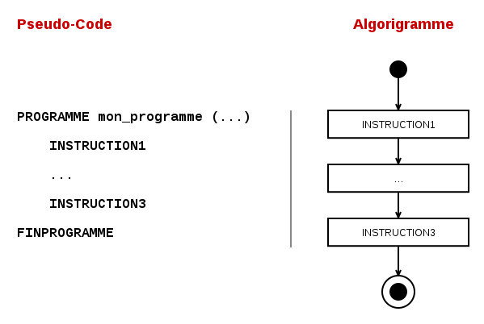
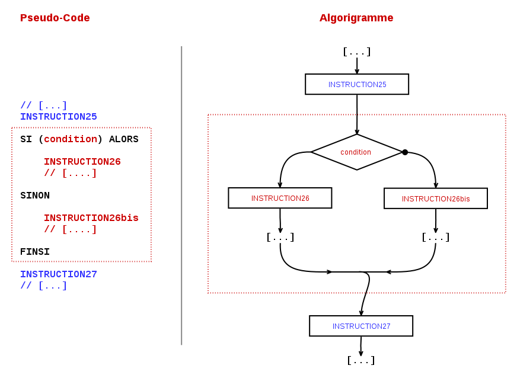
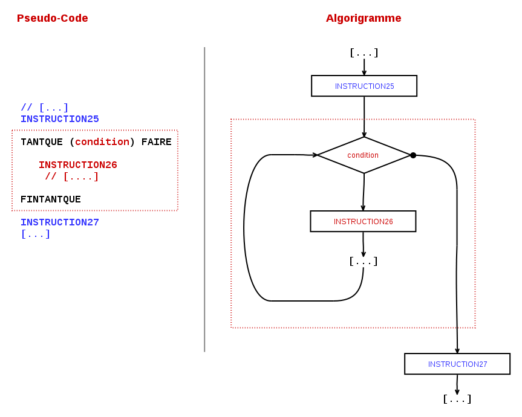
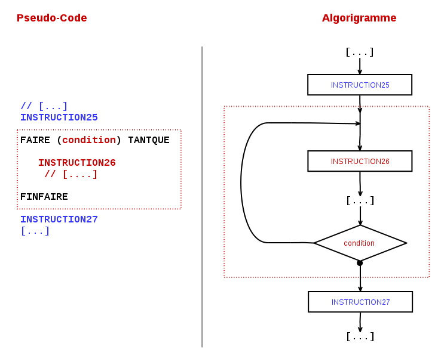

Pseudo-code I
==========

Excellent ! Je suis vraiment impressioné par ta motivation. 

Je profite du fait que cet épisode soit le plus long de la série à ce jour, pour te dire qu'en fait c'est la première fois que je fais ce genre de _truc_: je fais tout mon possible pour que tu trouves ça un peu intéressant, instructif, plaisant, voire divertissant...  (je me fais certainement des idées, mais on ne sait jamais !) :-)

Le plus dur c'est que étant "en aveugle", je ne sais pas si pour toi c'est difficile ou facile, si le rythme traîne ou s'il  est bon, s'il y a assez d'exemples, s'ils sont parlants ? Pire que tout : je ne sais même pas si mes blagues tombent à plat de façon honteusement lamentable... ou te font sourire (même juste un tout petit peu) ?

Bref. Tu imagines l'angoisse ? :-]

N'empêche, à continuer à ce rythme là, tu maîtriseras bientôt JavaScript ! ...et tu seras certainement en train de jouer (et gagner!) à [CodinGame](http://codingame.com/), débugguer du code les yeux fermés... ou développer [tes propres applications](http://www.mr-bin.fr) !

Alors... on reprend ?

> Il est actuellement 17h42 heure locale. 
> La température extérieure est de 19°.   
> Le commandant de bord et son équipage sont heureux d'avoir voyagé avec toi sur Algorigrammes Codinglines.
> Nous te souhaitons un agréable séjour en Pseudo-code  !

(Re-)présentation
------------------

Dans le tout premier chapitre, je t'avais dit que le pseudo-code était une des nombreuses représentations possible d'un programme. Cette fois, avec le pseudo-code, on va exprimer nos programmes en langue quasi-naturelle, en français (mais c'est également possible en toutes les langues). Nous allons donc écrire des programmes sous forme de textes.

Cette représentation a l'avantage d'être proche du résultat final tout en étant indépendante des difficultés ou bugs liées à la mise en place réelle sur un ordinateur ! C'est plutôt bien pour décrire ses idées avant de les confronter à la réalité technique avec un autre langage.

Comme tu peux t'en douter, contrairement aux algorigrammes, il ne s'agit pas d'une représentation normalisée, mais juste d'une représentatation _pratique à griffoner_ sur un bout de feuille, à penser, ou éventuellement à dire à l'oral (il te restera à trouver le bon interlocuteur ^_^) !  Au final, il y a certainement autant de variantes du pseudo-code que de développeurs...

En pseudo-code nous chercherons encore à lever toutes les ambiguïtés et à préciser tous les concepts que l'on utilise, exactement comme dans les algorigrammes. Nous retrouverons aussi toutes les petites choses auxquelles nous nous sommes progressivement habituées lors des chapitres précédent : variables, instructions conditionnelles, boucles, fonctions... (et votre humble serviteur !) 

Des algorigrammes au pseudo-code
---------------------------------------------------

Attend un instant.. si le pseudo-code n'est qu'une _représentation_ parmi d'autres... et si je te dis qu'on va faire comme dans les algorigrammes... Il y aurait donc des équivalences entre algorigrammes et pseudo-code ? 

Hé oui ! Voyons ça ...

### Instructions et structure du programme

Comme avec les algorigrammes, un programme est constitué d'un début, d'une suites d'instructions et d'une fin. Ces instructions peuvent prendre deux formes : __instructions simples__ et __blocs__ contenant plusieurs instructions.

On lit les instructions dans l'ordre des lignes : pour les instructions simple c'est tout, mais pour les blocs d'instructions, il pourra y avoir des règles particulières pour savoir sur quelle ligne on continue à lire le programme.

### Commentaires

Les commentaires sont des lignes de texte qui n'ont pas de sens du point de vue du programme et qui ne doivent pas être prises en compte. C'est un peu comme des annotations qu'on aurait pu faire autour de nos algorigramme pour expliquer telle ou telle partie.

Nous allons utiliser pour cela le symbole ``//`` . Tout ce qui sera à droite de ce symbole sera considéré comme un commentaire.

~~~
INSTRUCTION1
INSTRUCTION2
...

// Quatre lignes explicatives qui ne sont pas des instructions
// et qu'il ne faut donc pas prendre en compte dans le code
// mais qui peuvent être utiles pour comprendre ce qui 
// s'y passe !
INSTRUCTION31
INSTRUCTION32
~~~

### Déclaration des variables 

En pseudo-code et de nombreux langages de programmation on prendra l'habitude de déclarer les variables tout au début du programme. Cela permet au programmeur de savoir qui est chaque variable, et de _s'engager_ à ne l'utiliser que pour la description qui en est faite.

De plus, lorsqu'on utilisera des vrais langages informatiques, cela permettra de demander à l'ordinateur de préparer et donner des bouts de mémoire à notre programme : pour les étiquettes, pour les cases visées, etc.

~~~
PROGRAMME monprogramme(...)
    VARIABLE variable1 : description
    VARIABLE variable2 : description
    VARIABLE variable3 : description
    ...

    INSTRUCTION1
    INSTRUCTION2
    ...
    
FINPROGRAMME
~~~

### Assignation et lecture d'une variable

L'utilisation des variables se fait _exactement_ de la même manière en pseudo-code qu'en algorigrammes. La différence ? Pas besoin de mettre de rectangle autour !

### Entrées & sorties

### Structure conditionnelle

La structure conditionnelle est notre premier bloc d'instructions.

Autant dans les algorigrammes, on pouvait suivre les flèches pour choisir le "bon" coté du code à appliquer, autant en texte il va falloir ruser... puisqu'on ne peut écrire du code que de haut en bas ! 

L'astuce est simple : 

* Si la valeur de ``condition`` est VRAI, alors on fait les lignes en rouges de la zone en haut (``INSTRUCTION26 ...``), 
* Sinon c'est que ``condition`` est FAUX, on ignore la zone en haut pour passer directement aux lignes en rouges de la zone en bas (``INSTRUCTION26bis ...``). 
* Quand on a fini les lignes en rouges de la zone choisie, on passe directement aux instructions en bleu qui suivent (``INSTRUCTION27 ...``)

### Boucles

Les boucles sont également représentées sous forme d'un bloc d'instructions. Là aussi il faut ruser pour distinguer ce qui est _dans_ la boucle de ce qui est _à coté_.

Dans les chapitres précédents nous avions défini une boucle comme une zone de code répétée tant qu'une condition valait VRAI, mais nous n'avions pas précisé ou était la zone de code par rapport à notre condition ! Nous aurons donc deux façon de représenter les boucles, selon l'organisation de notre programme.

#### Boucles TANTQUE : où l'on teste la condition avant le premier tour

Dans cette version de la boucle, on choisit de tester la valeur de ``condition`` avant d'entrer dans la boucle.

* Si la valeur est VRAI, on passe aux instructions rouges ``INSTRUCTION 26...`` et suivantes. Quand c'est fait, on recommence à la ligne ``TANTQUE (condition) FAIRE`` et on se repose la question de la condition.
* Si la valeur est FAUX, on ignore les lignes en rouge et on passe directement aux instructions en bleu ``INSTRUCTION27 ...`` et suivantes.

#### Boucles FAIRE : où l'on teste la condition après un premier tour

Dans cette autre version de la boucle, on rentre directement sur les instructions ``INSTRUCTIONS26...``. Lorsque c'est fait on tombe sur la condition :

Dans cette version de la boucle, on choisit de tester la valeur de ``condition`` avant d'entrer dans la boucle.

* Si la valeur est VRAI, on remonte et on repasse par les instructions rouges ``INSTRUCTION 26...`` et suivantes, autant que nécessaire.
* Si la valeur est FAUX, on passe directement aux instructions en bleu ``INSTRUCTION27 ...`` et suivantes.

### Fonctions

Les fonctions... sont aussi des blocs d'instructions ! 

On remarque que dans l'appel et dans définition d'une fonction, on note des paramètres à coté du nom, entre parenthèses. Par exemple : ``afficher(mon_texte)``. 

#### Comment utiliser les paramètres ?

__Au niveau de la fonction appelante, ce sont les différentes valeurs  que l'on souhaite transmettre__ à la fonction appelée. Cela peut être directement des valeurs textuelles, numériques, etc. (``afficher("Hello world")``) ou bien des valeurs lues depuis des variables (``afficher(salutations)``).

__Au niveau de la fonction appelée, ces paramètres sont des variables__ que l'on a pas besoin de déclarer à l'intérieur de la fonction et qui seront initialisées à aux différentes valeurs que fournira l'appelant, au moment de l'appel et dans l'ordre des paramètres indiqués.

Par exemple si j'ai la fonction suivante (parfaitement valide) : 
~~~
FONCTION salutation(prenom, age)
    afficher("Salut " + prenom + ", toi qui a " + age + "ans")
FINFONCTION
~~~

* Lorsque j'appelerai ``salutation("Anatole", 52)``, cela affichera ``Salut Anatole, toi qui a 40 ans``
* Lorsque j'appelerai ``salutation("Philemon", 16)``, cela affichera ``Salut Philemon, toi qui a 16 ans``
* Lorsque j'appelerai ``salutation("Vendredi", 40)``, cela affichera ``Salut Vendredi, toi qui a 40 ans``
* Et ainsi de suite... les variables ``prenom`` et ``age`` changent de valeur à chaque appel, selon ce qui est passé en paramètres.

#### Comment utiliser la valeur de retour

__La valeur de retour est la valeur que l'on souhaite transmettre de la fonction appelée vers la fonction appelante.__ Elle est désignée par le mot clef ``RETOURNE``. 

Dans l'illustration ci-dessus, on voit que cette valeur est lue depuis la variable ``calcul`` du coté de ``fonction1`` et qu'elle est transmise à la fonction appelante ``fonction2``. Du coté de la fonction appelante, la valeur reçue est alors stockée dans la variable ``resultat``. On ne s'intéresse qu'à la valeur et on perd toute trace du fait que cette valeur était associée à une autre variable dans le _monde parallèle_ de la fonction ``fonction1``.

#### Autres détails

Évidemment, l'exécution des instructions contenues dans une fonction appelée se fait _uniquement_ au moment ou elle est mentionnée (avec ses paramètres) dans la fonction appelante.

D'ailleurs... lorsqu'on y réfléchit bien... un programme n'est rien de plus qu'une fonction qui serait la première à être appelé pour l'exécution ! Il appelle lui-même d'autres fonctions (qui en appellent éventuellement d'autres, etc.) !

> &mdash; Et comment savez-vous que vous êtes fou ? 
> &mdash;	Pour commencer, dit le Chat, est-ce que tu m’accordes qu’un chien n’est pas fou ? 
> &mdash;	Sans doute. 
> &mdash;	Eh bien, vois-tu, continua le Chat, tu remarqueras qu’un chien gronde lorsqu’il est en colère et remue la queue lorsqu’il est content. Or, moi je gronde quand je suis content, et je remue la queue quand je suis en colère. Donc, je suis fou. 
> <em>Lewis Caroll, Alice au pays des merveilles</em>

!!! note "Exercices 8.1 : videur sexiste & capacité maximum"
    La boite de nuit a une capacité maximum de 300
    personnes par nuit. Le travail du videur
    s'arrête lorsque ce nombre d'entrées est
    atteint.
    
    Sur la base du videur sexiste   :
    
    * __Écris en pseudo-code le programme du videur sexiste__ capable de capable de tenir compte de la capacité de la boite de nuit (reprise de l'exercice  5.d)
    * __Décompose le programme__ en plusieurs fonctions si possible ;-)

!!! note "Exercices 8.2 :  videur qui s'ennuie"
    Un soir, notre videur préféré s'ennuie. Pour s'amuser, il décide de faire rentrer 1 personne seule, puis un groupe de 2, puis un groupe de 3, puis de 4, puis de 5... et ainsi de suite.

    * __Quelle serait ta démarche__ pour connaître pour le nombre de personnes entrées dans la boite de nuit lorsque le groupe de 5 sera passé ?
    * __Écris une fonction en pseudo-code__ qui détermine combien de personnes seront dans la boite de nuit lorsque le groupe de 100 sera rentré ?
    * __Explique comment tu ferais__ pour adapter cette fonction pour calculer le nombre de personnes dans la boite après le groupe de 1000 ?

    

À suivre ?
----------

Voilà, c'est fait ! Les bases sont posées. Nous avons tous les éléments nécessaires pour faire du _vrai code_ !

Pour le prochain numéro, je te propose de ne pas trop nous attarder sur le pseudo-code et passer tout doucement vers JavaScript. Ce qui nous permettra en plus de voir notre code fonctionner !

Nous verrons aussi les solutions des exercices, évidemment.

Si le cœur t'en dis, j'attends impatiemment ton e-mail avec :

* un __pièce jointe pour les exercices__ (photo d'un papier ou document texte),
* un __petit message qui m'incite à écrire la suite__ :-)

