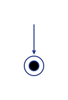

Algorigrammes (partie 2)
========================

Est-tu bien reposée ? Prête à reprendre ? As tu bien ton stylo-feutre-licorne toujours à la main ? Et ta feuille impatiente ? 

C'est fois c'est la bonne, on dessine !

Les instructions
----------------

Les __instructions__ sont les briques élémentaires de tout programme. Elle représentent les actions que _sait faire_ un ordinateur. Comme tu le constatera, il n'y en a pas beaucoup ! 

En fait les ordinateurs sont assez limités ! Programmer est un peu comme parler à un enfant de 8 ans atteint du [syndrome de Down](https://fr.wikipedia.org/wiki/Trisomie_21)... ça nécessite de bien tout expliquer... et s'il arrive qu'il ne comprenne pas, ce n'est pas de sa faute puisque c'est sa condition, il est comme ça. Il n'y peut rien. L'erreur de communication viendra forcément du donneur d'explications qui aura été trop rapide ou trop imprécis dans sa demande par rapport aux capacités de l'enfant handicapé.

Cela pourrait donner la situation imaginaire suivante : 

> « Dis petit, tu peux m'aider à peindre ce mur ?  
> &ndash; Moi aider ! Aider.. comment ? » demanda le petit trisomique, l'air perdu. 
> &ndash; Mais avec un pinceau !  
> &ndash; Ah pinceau !... C'est quoi pinceau ?  
> « Cette chose là ! » dis-je en lui tendant l'objet  
> Il prends le pinceau et reste immobile devant moi, l'air béat.  
> « Hmm. Tu fais quoi là ?  
> &ndash; Je peint, comme toi as dit... », me réponds-t-il.  
> « Mais non ! » craquais-je, « il faut faire des mouvements de bas en haut, comme ça ! ».  
> À peine eu-je fini ma phrase qu'il se mit à singer mes mouvements...  
> &ndash; « Oui, bon, c'est mieux..., mais tu oublies la peinture là... »

Tu verras que communiquer avec un ordinateur, c'est pareil : ça consiste essentiellement à décomposer tes idées en actions et en idées plus simples, puis à les décomposer encore et encore... jusqu'à les réduire à un ensemble de ces instructions toutes bêtes.

Je sais que dit ainsi, c'est encore un peu abstrait. Il donc est temps de passer à des exemples concrets et te présenter enfin les __instructions__ !

### Le début du programme

Comme son nom l'indique, c'est là où l'ordinateur va commencer l'exécution de notre programme.
Ensuite on suivra les flèches, dans l'ordre, pour passer d'une instruction à l'autre.

### La fin du programme

C'est l'endroit ou se termine le programme. L'ordinateur ne fait plus rien dans notre programme une fois arrivé à ce point. 

Pour des raisons de clarté, on essaiera d'avoir une seule fin représentée dans notre algorigramme. Cependant il pourra y avoir plusieurs flèches arrivant à la fin du programme.

### Les sorties

C'est le premier moyen qu'un programe peut utiliser pour interagir avec son environnement. Plus précisément un programme pourra utiliser une __sortie__ pour _transmettre de l'information vers l'extérieur_. On pourra donc utiliser tout périphérique branché à notre ordinateur (écran, imprimante, réseau, enceintes, etc.)

On dessine l'information que l'on souhaite transmettre dans la case inclinée _à gauche_ et le support sur lequel on va la transmettre dans la bulle _à droite_.

On remarque aussi que la flèche _va vers_ la bulle.

| Exemple 1. Afficher un texte à l'écran     |
|--------------------------------------------|
|  |

| Exemple 2. Envoyer un long texte sur l'imprimante |
|---------------------------------------------------|
|    |

### Les entrées

C'est le second moyen de communiquer avec l'environnement extérieur à un programme. Avec une __entrée__ on pourra _recevoir de l'information_ provenant de l'extérieur.

On dessine l'information que l'on souhaite recevoir dans la case inclinée _à gauche_ et le support sur lequel on va la recevoir dans la bulle _à droite_. 

On remarque que la flèche _vient_ de la bulle.

| Exemple 3. Envoyer un long texte sur l'imprimante |
|---------------------------------------------------|
|       |

### Les variables

Ce sont des petites cases mémoire dont le contenu peut _être modifié_ (et donc varier). 

Plus précisément c'est le nom que l'on va donner à _une case_ ou _un groupe de cases_ dans la mémoire de l'ordinateur... C'est comme une étiquette sur un bagage.

Tout d'abord, pour une variable donnée, on pourra lui __assigner une valeur__ : c'est à dire mettre une valeur dans la case désignée par l'étiquette. 
Par exemple, dans l'illustration ci-dessus on voit le résultat en mémoire après l'assignation de la valeur ``18`` dans la variable ``age``.

Il est possible d'assigner des valeurs depuis le programme lui-même, ou bien depuis une source d'information extérieure ! C'est là qu'interviennent les __entrées__ dont je te parlais plus haut.

| Exemple 4. Assignation depuis le programme lui-même |
|-----------------------------------------------------|
|  |

| Exemple 5. Assignation depuis une entrée |
|------------------------------------------|
|  |

Ensuite, pour une variable donnée, on pourra aussi __lire sa valeur__ : c'est à dire lire le contenu de la case mémoire désignée par l'étiquette. On pourra utiliser cette valeur pour l'envoyer vers une __sortie__, ou pour faire une opération utilisant la valeur et produire un résultat.

| Exemple 6. Lecture d'une variable : on affiche son contenu à l'écran |
|-----------------------------------------------------|
|  |

On peut même utiliser cette variable, faire une opération et enfin stocker le résultat dans cette même variable ! Avec ce type d'instructions, on lit le coté droit de la flèche avant le coté gauche : on lit les valeurs et on fait le calcul, on bientient un résultat et la variable (l'étiquette) désigne ensuite ce résultat.

| Exemple 7. Lecture d'une variable, on fait un calcul et on le stocke sous le même nom |
|-----------------------------------------------------|
|  |

> Un gros rosier se dressait près de l'entrée du jardin.
> Les fleurs qu'il portait étaient blanches mais il y avait 
> trois jardiniers qui s'activaient à les peindre en rouge.
> Alice trouva cela très étrange et s'approcha pour les observer de plus près.  
> <em>Lewis Carroll, Les aventures d'Alice au pays des merveilles</em>

À suivre ?
----------

Nous avons posé les bases. Mais que va-t-on faire de ces quelques petites
instructions de rien du tout ?  J'ai comme l'intuition qu'il nous manque un
petit quelque chose... mais quoi ? Nous le saurons au prochain épisode !

