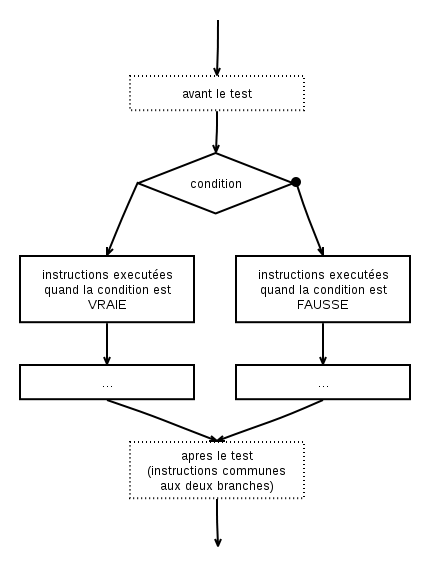
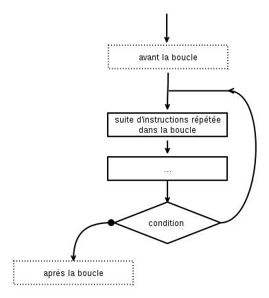

Algorigrammes (partie 3)
========================

Finissons tout doucement notre chemin vers la maîtrise des algorigrammes dans ce nouveau chapitre ;-)

> « C'est bien engagé coté Irlandais... 
> balle récupérée par Murphy... 
> par Hendrick... Pogba... 
> et oui, elle a été contrée ! »  
> <em>Euro 2016, France-Irlande (2-1)</em>

Retour sur les instructions
---------------------------

Dans le chapitre précédent, je te présentais les quelques  __instructions__ de base d'un programme : le début, la fin, les entrées, les sorties, les variables.

Voyons un premier algorigramme qui assemble toutes ces briques vues jusque là :

Alors, comment interpréter cela ? C'est très simple :

1. on démarre sur le rond noir (début), 
2. on suit la flèche,
3. on arrive sur une instruction de sortie, qui prends le texte ``"Quel est ton nom"`` et qui l'affiche sur le périphérique ``Ecran``,
4. on suite la flèche,
5. on tombe sur une instruction d'entrée, c'est à dire que le programme attend que l'utilisateur tape quelque chose, cela peut être n'importe quoi (par exemple : ``"Anatole"``). Lorsqu'il valide, le resultat est enregistré dans la variable (c'est à dire une case mémoire pointée par une étiquette) que l'on choisit d'appeller ``nom``,
6. on suit la flèche,
7. on arrive sur une nouvelle sortie qui prends le texte ``"Bonjour "`` et qui lui ajoute la variable ``nom`` (c'est à dire le contenu de la case mémoire pointé par l'équiquette). On obtient donc en mémoire le texte ``"Bonjour Anatole"`` qui part alors vers le périphérique ``Écran``.
8. on suit la flèche,
9. on arrive sur le rond cerclé, c'est donc la fin du programe.

Whaou. Nous sommes donc capables de demander un nom à l'utilisateur et de le saluer ! Pas mal pour un premier programme, non ?

Les instructions que nous avons vues jusque là permettent de faire bien des choses, mais elle ont un toutes gros inconvénient : elle ne permetttent la conception que des programes _totalement linéaires_, quelle que soient les valeurs des variables ou les entrées du programme.

Pour améliorer cela, il faudrait être capable d'exprimer des conditions, et de faire des choix... et c'est là qu'interviennent les __expressions booléennes__ et les __instructions conditionnelles__.

Les expressions booléeennes
---------------------------

Les __expressions booléennes__ sont des affirmations dont le résultat est soit ``VRAI``, soit ``FAUX``. Cela peut être une comparaison, une formule, ou le résultat d'un sous-programme (on en parlera plus tard de ce dernier point). Ce sont elles que nous allons utiliser comme conditions pour décider de la suite de notre programme.

On appelle ``VRAI`` et ``FAUX`` des _valeurs booléennes_. Sur la base de ces valeurs on peut définir quelques opérations logiques :

### La négation (NON ...)

Elle inverse la valeur de départ (ici A).

| A   | non A |
|------|------|
| VRAI | FAUX |
| FAUX | VRAI |

### Conjonction (... ET ...)

Elle n'est vraie que si les deux valeurs de départ (A, B) sont toutes deux vraies.

| A    | B    | A et B |
|------|------|--------|
| VRAI | VRAI | VRAI   |
| VRAI | FAUX | FAUX   |
| FAUX | VRAI | FAUX   |
| FAUX | FAUX | FAUX   |

### Disjonction (... OU ...)

Elle est vraie si l'une des deux valeurs de départ (A, B) est vraie.

| A    | B    | A ou B |
|------|------|--------|
| VRAI | VRAI | VRAI   |
| VRAI | FAUX | VRAI   |
| FAUX | VRAI | VRAI   |
| FAUX | FAUX | FAUX   |

### L'exclusion mutuelle (... XOR ...)

Elle n'est vraie que si les deux valeurs (A, B) sont différentes.

| A    | B    | A xor B |
|------|------|---------|
| VRAI | VRAI | FAUX    |
| VRAI | FAUX | VRAI    |
| FAUX | VRAI | VRAI    |
| FAUX | FAUX | FAUX    |

### Propriétés des opérateurs

Les opérateurs de l'algèbre booléenne ont tout un ensemble de propriétés comme les opérateurs des mathématiques : _commutativité_, _distributivité_, etc. 
Si cela t'intéresse, je te renvoie à [la page Wikipedia](https://fr.wikipedia.org/wiki/Alg%C3%A8bre_de_Boole_%28logique%29#Propri.C3.A9t.C3.A9s_des_op.C3.A9rateurs), mais nous y reviendrons de toute façon lorsque nous en aurons besoin dans quelques chapitres.

> L'autre dimanche, le serveur m'a demandé :  
> « Vous voulez du carot'cake ou de la tarte au citron ? »  
> Et là, j'ai instinctivement répondu « VRAI ! »... 
> <em>Déformation professionelle n°5</em>

Les instructions conditionnelles
--------------------------------

Les __instructions conditionnelles__ sont des instructions qui offrent plusieurs chemins possibles pour le programme à partir d'une même instruction. Pour cela elle permettant également de prendre des décisions sur le chemin à prendre en fonction de certaines conditions.

### Les tests conditionnels

Les __tests conditionnels__ sont des instructions qui possèdent deux branches et servent à orienter le programme en fonction d'une condition :

* Si la condition vaut ``VRAI``, on suivra le chemin de la flèche normale (à gauche dans l'illustration ci-dessous),
* Si la condition vaut ``FAUX``, on suivra la flèche _notée par un cercle_ ou une croix (à droite dans l'illustration ci-dessous).

Les branches d'un test conditionel peuvent contenir autant d'instructions que l'on souhaite et elle peuvent être de tout les types possibles (on peut tres bien mettre un test conditionel dans un test conditionnel dans un test conditionnel si on veut...).

Même si ce n'est pas obligatoire sur le papier (puisqu'on peut dessiner comme on veut), les branches d'un test conditionnel finissent toujours par se rejoidre dans un vrai programme : après les branches, on a soit une suite commune d'instructions, soit les branches pointent directement sur la fin du programme.

Remarque également qu'avec l'instruction de __test conditionnel__ les deux flèches de chemin partent _vers le bas_ du programme.

#### Exemple 5.1. Le videur de base

Pour illustrer mes propos sur les tests conditionnels, prenons un exemple que tu as sûrement déjà vécu : le videur à l'entrée de la boite de nuit. Son rôle est simple: il vérifie l'age de la personne qui se présente à l'entrée, et ne laisse passer que les adultes dans la boite de nuit. S'il était un programme, son travail ressemblerait à cela :

#### Exemple 5.2. Le videur sexiste

Comme beaucoup de videurs, il arrive que celui-ci soit sexiste : après avoir vérifié l'age, il laisse automatiquement passer les filles (ne me demande pas pourquoi...), en revanche, un mec devra obligatoirement être accompagné pour passer !

Cela donnerait l'algorigramme suivant :

<!-- ex 5.1 et 5.b -->

### Les boucles

Les __boucles__ sont très semblables aux __test conditionnels__. La différence ? Les boucles possèdent un chemin qui part _vers l'arrière_ du programme. Elle sont les seules instructions à avoir la possibilité de faire cela.

Comme l'une des flèche part vers l'arrière, il y a toute une partie du code qui sera répétée entre la flèche qui remonte et la condition de la boucle, on appelle cette partie le __corps de la boucle__. 

As-tu déjà vu un programme _freezer_ ? ou bien un logiciel dont la fenêtre ne répond plus ? Eh bien c'est une boucle infinie dans le programe ! C'est pour cela qu'il est _vital_ de correctement définir la condition d'une boucle, car c'est elle qui permettra de continuer ou d'arrêter (et sortir) de la boucle. On parlera dans ce cas de  __condition de continuation__ ou de __condition d'arrêt__ (l'un étant l'inverse de l'autre).

Lorsque tu feras des boucles, fais bien attention à ce que le __corps de la boucle__ contienne bien des instructions qui influent sur __la condition de continuation__, sinon c'est que la boucle n'est influencée qu'une fois pour toutes par quelque chose d'antérieur... et c'est une boucle infinie garantie.

#### Exemple 5.3. Afficher les chiffres de 1 à 10

Dans l'exemple qui suit, il s'agit d'afficher tous les chiffres de 1 à 10, sans faire nous même l'affichage de toutes les valeurs intermédiaires ! D'accord, ça ne serait pas trop difficile pour 1 à 10, mais imagine de 1 à 100... ou de 1 à 1000 ! C'est là qu'il faut être astucieux ! 

Pour cela, nous utilisons un ``compteur`` : c'est à dire une variable que nous allons charger de savoir à quel tour nous en sommes tout au long du programme. Pour cela il faut l'initialiser correctement au début, puis la mettre à jour à chaque tour de boucle (en ajoutant 1 à la variable). Et comme elle sert justement à _compter_, on l'utilise également pour afficher le numéro du tour actuel.

Notre condition de boucle vérifie à chaque tour que le compteur  __ne dépasse pas 10__ et PAF (!), ça donne bien la suite des nombres de 1 à 10 !

#### Exemple 5.4. Afficher les chiffres de 10 à 1 (à l'envers)

Presque le même exemple qu'au dessus : on utilise également un compteur, sauf que cette fois-ci nous allons l'initialiser à la valeur la plus grande au début puis compter en arrière, en retirant 1 à la variable chaque tour !

Conclusion
----------

Ouf, cette fois-ci c'était un peu plus costaud ! Nous allons donc prendre le temps de bien assimiler tout ça avant d’enchaîner vers la dernière notion qui reste... puis vers du vrai code.

Pour le prochain numéro, je te propose de voir en détail les solutions des exercices, et je vais aussi en profiter pour te présenter une démarche d'analyse permettant de partir d'un problème (ou d'un énoncé) et de construire un programme.

