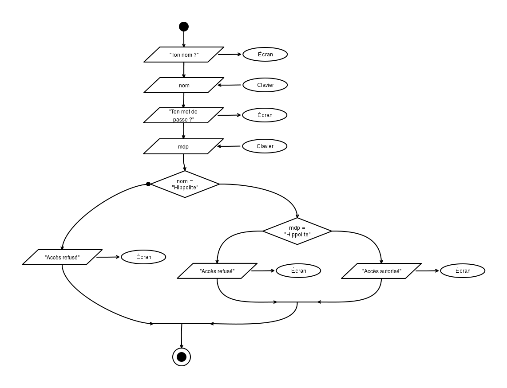
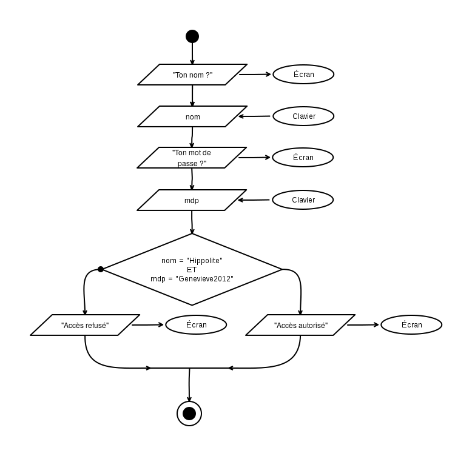
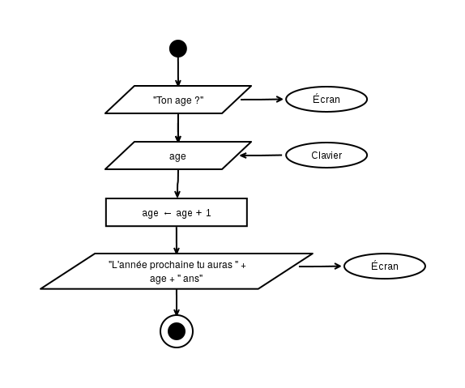
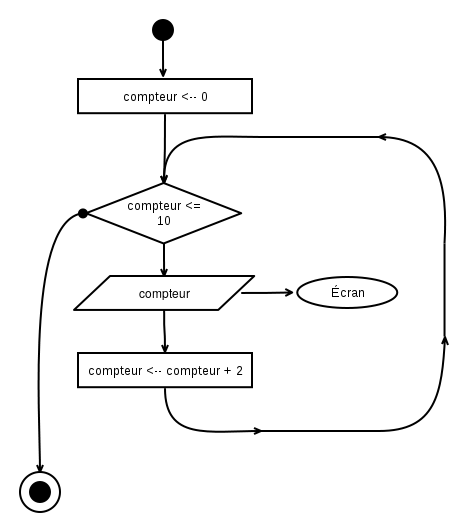

# Corrigés des exercices sur les algorigrammes 

## Solution 5.a : Login, mot de passe et accès...

### Énoncé

### Solution 

* __De quoi va t-on avoir besoin comme variables ?__ Une pour stocker le nom (``nom``), et une autre pour stocker le mot de passe (``motdepasse``).
* __Comment sont-elles initialisées ?__ Au clavier.
* __Est-ce que certaines parties doivent être répétées ?__ Non.
* __Est-ce qu'il y a des choix à faire quelque part ?__ Oui, selon ce que contient ``motdepasse``.

Ici, l'ordre des autres instructions est quasiment donné par l'énoncé.

Ce qui nous donne : 

C'est bien, ça fait le job, mais on peut simplifier. Dans le chapitre [Algorigrammes III](05-algorigrammes), on mentionnait les expressions booléennes. On va les utiliser pou rassembler les deux conditions en une seule. 

On va donc écrire :

<!--
Commentaires sur ta solution : 

* __C'est très bien !__ Rien à redire au niveau de la logique : c'est une variante de la version non simplifiée. Ça fonctionne. 
* __Il manque des guillemets autour du texte__ qui est envoyé vers l'écran (ex: "Quel est ton nom ?" en haut,  "MDP ?" à mi-hauteur, "Accès refusé" à gauche, etc.). Sans les guillemets on croit que ce sont des variables !
* C'est intéressant que tu aie mis les instructions pour la demande du mot de passe dans la branche à droite (après le test du nom)... et ça fait gagner du temps si le nom n'est pas bon (pas besoin de demander une information inutile). C'est bien vu.

!!! note "Hors-sujet"
    Si on s'intéresse à une utilisation réelle, __ton programme pose un problème de sécurité.__
    
    Une personne non-autorisée pourrait [essayer différents noms](https://fr.wikipedia.org/wiki/Attaque_par_dictionnaire)... et selon que "mot de passe ?" apparaît ou non, cela lui donnerait un indice sur l'existance (ou non) de cet utilisateur dans le système. Une fois un nom correct trouvé, il lui resterait à se concentrer sur les mots de passes !

    En termes de sécurité, on préfèrera donc demander toutes les informations d'un coup et présenter un comportement identique en cas de refus, qu'une seule ou que plusieurs informations soient fausses. Ne laissons pas fuiter d'indices !
-->

## 5.b - Calculer une valeur

### Énoncé 

__Dessine un programme__ qui demande à l'utilisateur de taper son age et le stocke dans la variable ``age``.
Calcule l'age qu'il aura l'année prochaine et stocke le résultat dans la variable ``age`` (la même). Ensuite affiche-lui le message ``"L'année prochaine, tu auras XX ans"`` (avec XX remplacé par son âge prochain).

### Solution

* __De quoi va t-on avoir besoin comme variables ?__ Une pour stocker l'age entré par l'utilisateur... et c'est tout (puisqu'on nous dit d'utiliser la même pour l'age futur que l'on calculera).
* __Comment sont-elles initialisées ?__ Depuis une valeur entrée au clavier.
* __Est-ce que certaines parties doivent être répétées ?__ Non.
* __Est-ce qu'il y a des choix à faire quelque part ?__ Non.

<!--
Commentaires sur ta solution : 

* __Tu es en avance sur le cours !__ Pour l'instant on ne peut pas encore écrire ``<age>`` en plein milieu d'un texte, parce qu'il faudrait comprendre comment ça fonctionne (et pour l'instant on ne sait pas) !  En plus ça ne fonctionne pas partout : on retrouvera cette écriture bien pratique dans certains langages de programmation (PHP, Ruby, etc.) mais pas dans d'autres (Javascript, C, etc.). Ce sera également possible lorsque tu apprendras à manipuler des _templates_ (des morceaux de HTML dans lequel on remplace certaines zones par le contenu des variables). Mais bon... pour l'instant on va seulement coller des bouts de texte les uns à coté des autres :-)
-->

## 5.c - Compter de deux en deux

### Enoncé 

Sur la base de l'exemple 5.3, __dessiner un algorigramme__ qui compte de 0 à 10, de deux en deux (et qui affiche donc ``0..2..4..6..8..10``).

### Solution 

* __De quoi va t-on avoir besoin comme variables ?__ Un ``compteur``
* __Comment sont-elles initialisées ?__ On démarre le compteur à zéro.
* __Est-ce qu'il y a des choix à faire quelque part ?__ Non.
* __Est-ce que certaines parties doivent être répétées ?__ Oui, on répète l'affichage et on ajoute 2 au  ``compteur`` à chaque tour.
* __Quand est-ce qu'on arrête la boucle ?__ Quand on dépasse 10.

<!--
Commentaires sur ta solution : 

* __C'est parfait !__ j'ai copié ta solution pour le corrigé :-)
-->

## 5.d - Videur limité à 300 visiteurs

### Enoncé 

__Sans dessiner__ l'algorigramme, comment ferais-tu pour adapter le videur de base (exemple 5.1) afin qu'il ne laisse entrer que 300 visiteurs dans la boite de nuit ?

* Que faudrait-il ajouter ?

### Solution 

Pour adapter le videur de base (exemple 5.1) afin qu'il ne laisse entrer que 300 visiteurs dans la boite de nuit, il faudrait :

* compter les visiteurs (avec une variable ``visiteurs``)
* ajouter une boucle (qui continue tant que ``visiteurs <= 300``)
* incrémenter cette variable à chaque tour (``visiteurs <-- visiteurs + 1``)

<!--
Commentaires sur ta solution : 

* __C'est good !__ Rien à redire.

-->

## 8.1 : videur sexiste & capacité maximum

### Enoncé 

La boite de nuit a une capacité maximum de 300
personnes par nuit. Le travail du videur
s'arrête lorsque ce nombre d'entrées est
atteint.

Sur la base du videur sexiste   :

* __Écris en pseudo-code le programme du videur sexiste__ capable de capable de tenir compte de la capacité de la boite de nuit (reprise de l'exercice  5.d)
* __Décompose le programme__ en plusieurs fonctions si possible ;-)

### Solution 

FIXME

## 8.2 - Videur qui s'ennuie

### Enoncé

Un soir, notre videur préféré s'ennuie. Pour s'amuser, il décide de faire rentrer 1 personne seule, puis un groupe de 2, puis un groupe de 3, puis de 4, puis de 5... et ainsi de suite.

* __Quelle serait ta démarche__ pour connaître pour le nombre de personnes entrées dans la boite de nuit lorsque le groupe de 5 sera passé ?
* __Écris une fonction en pseudo-code__ qui détermine combien de personnes seront dans la boite de nuit lorsque le groupe de 100 sera rentré ?
* __Explique comment tu ferais__ pour adapter cette fonction pour calculer le nombre de personnes dans la boite après le groupe de 1000 ?

### Solution 

FIXME

